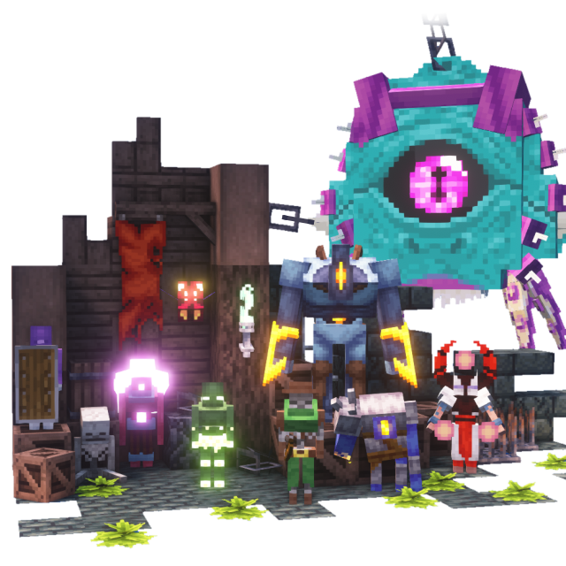

# Welcome to Mim1q's Mod Wiki!

---

## Mine Cells {: .invisible-heading}

  

[Wiki](./minecells/index.md) -
[CurseForge](https://www.curseforge.com/minecraft/mc-mods/minecells) -
[Modrinth](https://modrinth.com/mod/minecells) -
[GitHub](https://github.com/mim1q/MineCells) -
[Issues](https://github.com/mim1q/MineCells/issues)

Dead Cells in Minecraft

---

## Convenient Decor

[CurseForge](https://www.curseforge.com/minecraft/mc-mods/convenient-decor) -
[Modrinth](https://modrinth.com/mod/convenient-decor) -
[GitHub](https://github.com/mim1q/convenientdecor) -
[Issues](https://github.com/mim1q/convenientdecor/issues)

Decorative blocks for every occasion, with included functionality!

---

## Derelict

[CurseForge](https://www.curseforge.com/minecraft/mc-mods/mim1q-derelict) -
[Modrinth](https://modrinth.com/mod/derelict) -
[GitHub](https://github.com/mim1q/derelict) -
[Issues](https://github.com/mim1q/derelict/issues)

Expansion focused around things taken over by nature, abandoned and inaccessible

---

## Convenient Name Tags

[CurseForge](https://www.curseforge.com/minecraft/mc-mods/convenient-name-tags) -
[Modrinth](https://modrinth.com/mod/convenient-name-tags) -
[GitHub](https://github.com/mim1q/convenientnametags) -
[Issues](https://github.com/mim1q/convenientnametags/issues)

A few simple utilities for Name Tags

---
