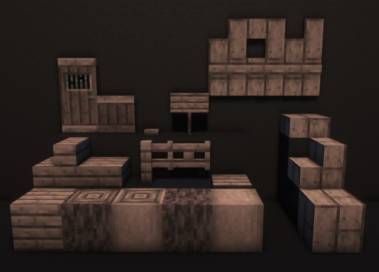
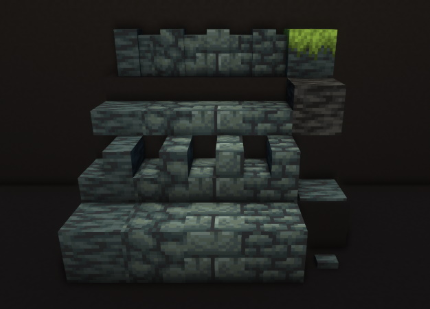
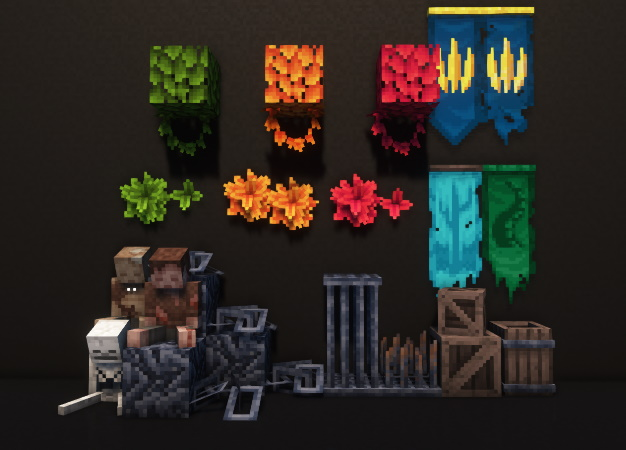
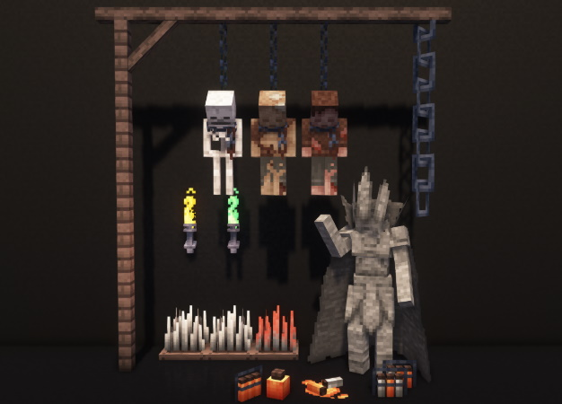

# Decorative Blocks

Mine Cells adds _lots_ of decorative blocks to make the structures as close to the source material
as possible. Feel free to go into creative mode to check them out, and use a mod like REI
to find out if they're craftable or if you have to hunt for them in the dimensions of Mine Cells!

---

## Putrid Wood

Tip: The thin Putrid Boards (top right in the screenshot) can have their variant changed by right-clicking
them with any axe.

---

## Prison Stone

---

## Miscellaneous

---