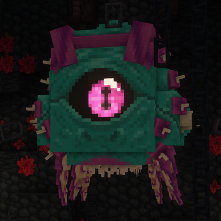
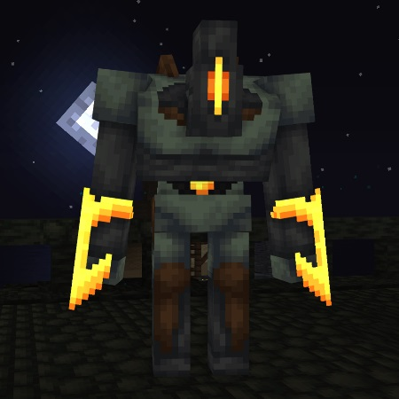

# Bosses

---

## Conjunctivius

{: .side-image}

The Conjunctivius is a massive mutant creature that emerged from the sewers.
She has been contained and chained to the walls of her chamber in the hopes
it will keep her from wreaking havoc

/// info | Spawns in

- [Insufferable Crypt](./dimensions.md#insufferable-crypt)
  ///

/// info | Drops

- Diamonds, gold and emeralds
- Cursed Sword
- Conjunctivius' Tentacle
  ///

/// info | Boss fight description
In the first phase Conjunctivius has two attacks:

- A body slam where she will extend her spikes and charge at a player
- A lacerating aura activated when a player gets too close to her

Upon reaching a certain health threshold she will scream, summoning a few
[Sewers' Tentacles](./enemies.md#sewers-tentacle). She will remain invincible
until all the tentacles have been killed. After the first tentacle phase the
Conjunctivius gains a new attack:

- A barrage of bolts targeted at a player

The Conjunctivius will enter the tentacle phase two more times, and after the
last one she will gain the last attack, which is quite rare:

- A massive barage of bolts, flying in random directions and taking up the whole room

After the three tentacle phases are done, the Conjunctivius can be killed.

///

---

## Concierge

{: .side-image}

The Concierge guards the Black Bridge, preventing anyone from passing it.

/// info | Spawns in

- [Black Bridge](./dimensions.md#black-bridge)
  ///

/// info | Drops

- Diamonds, gold and emeralds
- The Flint

///

/// info | Boss fight description
The Concierge has these abilities from the start of the fight:

- Powerful punch that knocks you far back
- Shockwave attack that sends fire around the Concierge in a circle
- A damaging aura

After reaching certain thresholds of health, the Concierge will shout,
gaining immunity for a moment. After that, his attacks will get more powerful
and faster.

After the first shout, Concierge gains one additional ability:

- Leap towards the player from afar

///
