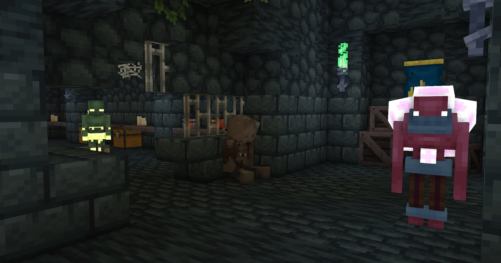
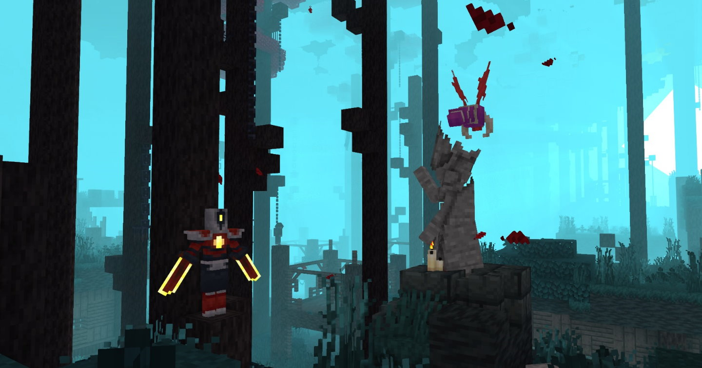
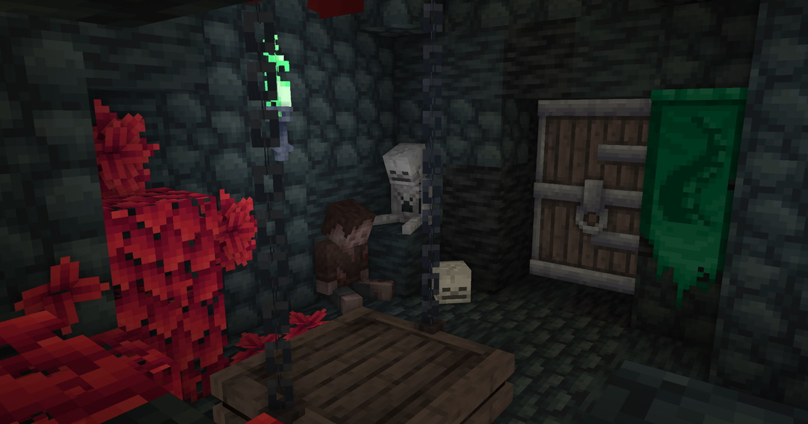

# The Dimensions of Mine Cells

---

## Prisoners' Quarters

A network of corridors linking the cells inhabited by what used to be the prisoners...

/// info | Accessible from: 
  - Overworld
///

/// info | Leads to:
  - [Promenade of The Condemned](#promenade-of-the-condemned)
  - [Insufferable Crypt](#insufferable-crypt) - requires [Vine Rune](./runes.md#vine-rune)
/// 

/// info | Mobs:
  - [Leaping Zombie](./enemies.md#leaping-zombie)
  - [Grenadier](./enemies.md#grenadier)
  - [Shieldbearer](./enemies.md#shieldbearer)
  - [Undead Archer](./enemies.md#undead-archer)
///

---

## Promenade of The Condemned

The yard of the Prison, with a _really nice_ atmosphere

/// info | Accessible from: 
  - [Prisoners' Quarters](#prisoners-quarters)
///

/// info | Leads to:
None
///

/// info | Mobs:
  - [Leaping Zombie](./enemies.md#leaping-zombie)
  - [Grenadier](./enemies.md#grenadier)
  - [Runner](./enemies.md#runner)
  - [Mutated Bat](./enemies.md#mutated-bat)
///

---

## Insufferable Crypt

Even the rats avoid this place...

/// info | Accessible from: 
  - [Prisoners' Quarters](#prisoners-quarters) - requires [Vine Rune](./runes.md#vine-rune)
///

/// info | Leads to:
  - Overworld
///

/// info | Mobs:
  - [**Conjunctivius**](./bosses.md#conjunctivius) - boss
  - [Sewers' Tentacle](./enemies.md#sewers-tentacle)
///

---