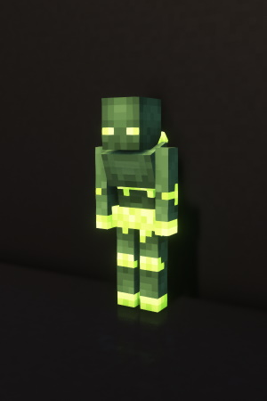
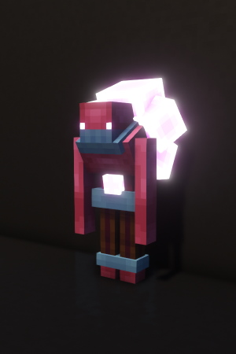
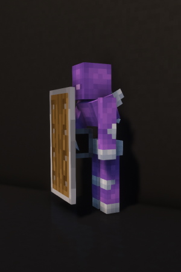
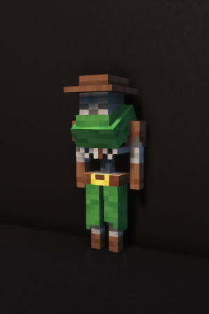
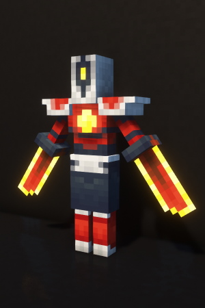
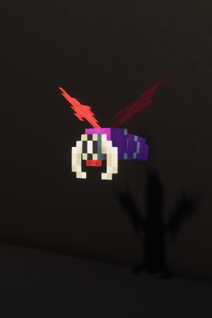
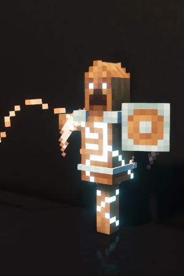
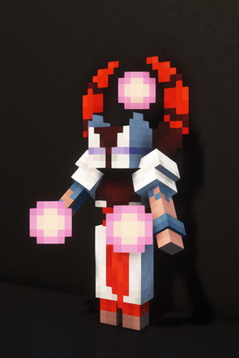
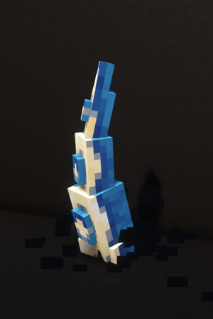

# Enemies of Mine Cells

All of these enemies aim to be faithful representations of the monster of Dead Cells.
The drops aren't very exciting right now, but will likely be improved upon as the mod's
development progresses!

---

## Leaping Zombie

{: .side-image }

The basic enemy of Mine Cells. Really common, attacks in melee range or by jumping at you.

/// info | Spawns in
  - Overworld (portal structure)
  - [Prisoners' Quarters](./dimensions.md#prisoners-quarters)
  - [Promenade of The Condemned](./dimensions.md#promenade-of-the-condemed)
///

/// info | Drops
  - Rotten Flesh
  - Guts
  - Monster's Eye (rare)
///

---

## Grenadier

{: .side-image }

Throws exploding bombs in your direction. 

/// info | Spawns in
  - Overworld (portal structure)
  - [Prisoners' Quarters](./dimensions.md#prisoners-quarters)
  - [Promenade of The Condemned](./dimensions.md#promenade-of-the-condemed)
///

/// info | Drops
  - Rotten Flesh
  - Guts
  - Monster's Eye (rare)
///

---

## Shieldbearer 

{: .side-image }

Charges their shield at you. Cannot be attacked from the front.

/// info | Spawns in
  - Overworld (portal structure)
  - [Prisoners' Quarters](./dimensions.md#prisoners-quarters)
///

/// info | Drops
  - Rotten Flesh
  - Guts
  - Monster's Eye (rare)
///

---

## Undead Archer

{: .side-image }

Shoots arrows. Pretty much like a regular Skeleton.

/// info | Spawns in
  - [Prisoners' Quarters](./dimensions.md#prisoners-quarters)
///

/// info | Drops
  - Rotten Flesh
  - Guts
  - Monster's Eye (rare)
///

---

## Runner

{: .side-image }

Performs a melee attack with a long windup that deals a ton of damage. Can teleport to you if you're far.

/// info | Spawns in
  - [Promenade of The Condemned](./dimensions.md#promenade-of-the-condemed)
///

/// info | Drops
  - Phaser (rare)
///

---

## Mutated Bat

{: .side-image }

Has very little health but spawns in groups. Flies around you and dashes to attack.

/// info | Spawns in
  - [Promenade of The Condemned](./dimensions.md#promenade-of-the-condemed)
///

---

## Protector

{: .side-image }

Grants nearby hostile mobs the [Protected](status-effects.md#protected) status effect.
Does not attack by itself.

/// info | Spawns in
  - [Promenade of The Condemned](./dimensions.md#promenade-of-the-condemed)
///

---

## Inquisitor

{: .side-image }

Shoots magic orbs that can phase through walls.

/// info | Spawns in
  - Overworld (portal structure)
///

---

## Sewers' Tentacle

{: .side-image }

Burrows under the ground and navigates toward you. Will unburrow to strike the player or perform a long-range charge if the path is clear.

/// info | Spawns in
  - [Insufferable Crypt](./dimensions.md#insufferable-crypt)
///

---