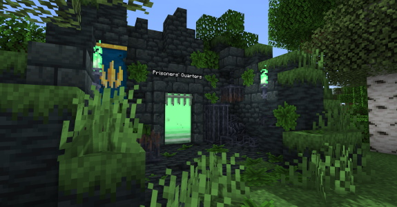
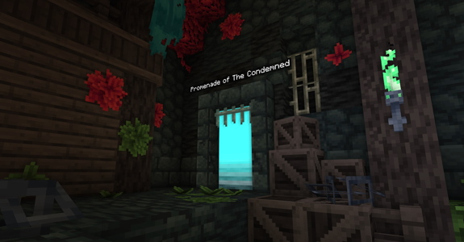
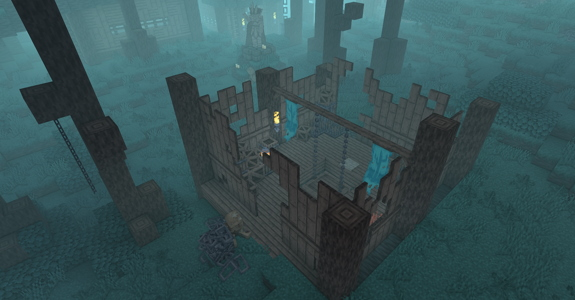
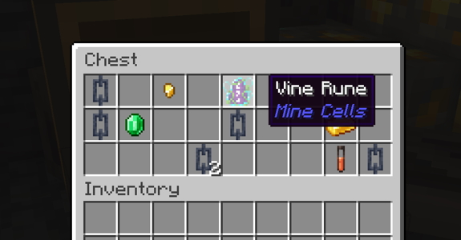
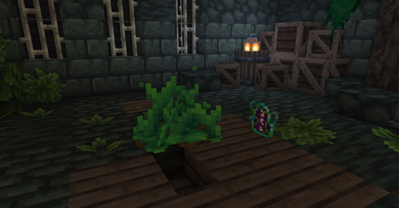
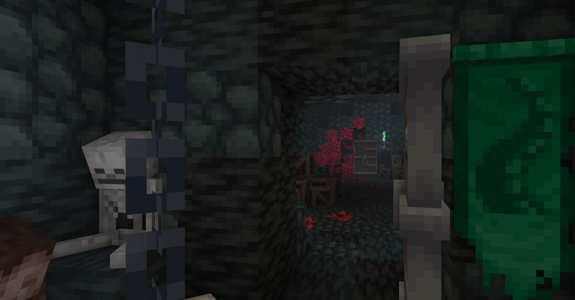

# Mine Cells Tips and Progression Guide

## General Tips

- The Big Chains are climbable!
- A compass will guide you back to the entrance of a given dimension.
- A doorway will have a star `*` next to the dimension name if you haven't visited it in a particular area yet.
- The doors leading to Boss rooms will close behind you! Make sure to be ready for the fight.
- The Boss rooms will also give you the [Disarmed Status Effect](status-effects.md#disarmed), making you unable to
  place and break blocks.
- The Cursed Sword's [curse](status-effects.md#cursed) is quite deadly. Be cautious when holding it in your hand!

---

## Recommendations

/// info | Recommended Mods
  I recommend using these mods along with Mine Cells for the best experience:

  - [Sodium](https://modrinth.com/mod/sodium) + [Iris](https://modrinth.com/mod/iris) - performance boost + shader support
  - [Roughly Enough Items](https://modrinth.com/mod/rei) - a must have to check the crafting recipes of items!
  - [Better Combat](https://modrinth.com/mod/better-combat) - custom attack animations for the weapons of Mine Cells
  - [Lootr](https://www.curseforge.com/minecraft/mc-mods/lootr-fabric) - loot in chests is generated for each player separately
  - [Gravestones](https://modrinth.com/mod/gravestones) - will make retrieving your items after death a lot easier
  - [Disable Custom Worlds Advice](https://modrinth.com/mod/dcwa) - removes the annoying pop-up every time you open a world
///

/// info | Recommended Shader Packs
  The best shader packs to use with Mine Cells are (in my opinion):

  - [Sildurs Enhanced Default](https://sildurs-shaders.github.io/downloads/) - lightweight shaders that don't change the intended feel 
    of the dimensions (they keep the original fog)
  - [Complementary Shaders](https://modrinth.com/shader/complementary-shaders-v4) - visually amazing, the bloom on emissive entities looks 
    really good and the colors are on point. The original fog is replaced, so dimensions like the Promenade of the Condemned look completely
    different than intended (but pretty astonishing nonetheless)
  - [Complementary Reimagined](https://modrinth.com/shader/complementary-reimagined) - similar to the previous one, but the bloom is slightly 
    too strong by default and the colors are a bit off
///

/// info | Recommended Music
  I recommend having the amazing [Original Dead Cells Soundtrack](https://open.spotify.com/album/5MuOiTfGZfVbZ1rPcDX5A0?si=80gkChL0SSiO3VKUetQQxQ)
  by [Yoann Laulan](https://open.spotify.com/artist/3B8Bws0xi45LCMW42h8jys?si=3g-Os2h9TU2ixeYLVlMJ6Q) on in the background when exploring the mod.
  It will definitely help you get immersed in the world, especially if you have played Dead Cells before!
///

/// info | Dead Cells
  If you like the mod I highly recommend you check out [Dead Cells by Motion Twin on Steam](https://store.steampowered.com/app/588650/Dead_Cells/)!
  It is an amazing game made by an amazing studio, and the source material for most content of this mod! If you like fast-paced exciting combat
  that is dependent on your skill and not pure luck, then the game is definitely for you.
///

---

## Progression Guide 

If you'd rather explore the mod and experiment until you find your answers, do not open!

Here are the steps that will help you progress through the mod:

/// details | Show progression guide
    type: tip

  1. Find a doorway to the Prisoners' Quarters in the Overworld.  
     `/locate structure minecells:overworld_portal`  

     

     ---

  2. Reach the bottom of the Prisoners' Quarters where you will find a portal to the Promenade of The Condemnded.

       

     ---

  3. Explore the Promenade until you find an elevator to an underground dungeon.  
     `/locate structure minecells:promenade_underground`

       

     ---

  4. Get to the bottom of the dungeon and obtain the **Vine Rune**.

     

     ---

  5. Return to the Prisoners' Quarters and use the **Vine Rune** on a **Runic Vine Plant** found on the top floor.

     

     ---

  6. Fight the Conjunctivius! Warning: The door will close behind you!

     

     ---

  7. Return to the Overworld with your loot
///
