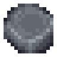
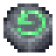
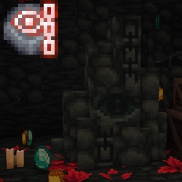
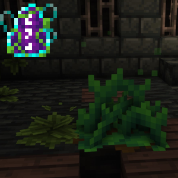

# Runes

---

## Blank Rune

Used as a crafting ingredient for all the craftable runes. These use the Blank Rune as the background
to make them easier to distinguish from the non-craftable ones.

---

## Reset Rune

Holding right-click with this rune in hand will teleport you back to the entry of the dimension you're in.
It will reset all the Spawner Runes that you have activated in that particular dimension and area. That means
you will be able to go through that area again, with all the mobs spawning like the first time (the chests and
everything else will not get reset, but that may change in a future update!)

---

## Boss Respawn Runes

The Boss Respawn Runes allow you to respawn bosses. Right now the only boss is Conjunctivius, so only
the Conjunctivius Respawn Rune exists. You can use it on the Boss Respawn Obelisk (shown in the screenshot) 
that comes out of the ground after the boss was killed. After a short animation the boss will be respawned.

---

## Vine Rune

The Vine Rune is found in the [Promenade of the Condemned](./dimensions.md#promenade-of-the-condemned).
It's used to activate the Runic Vine Plants (shown in the screenshot), which will sprout granting you 
access to previously inaccessible spots.

---